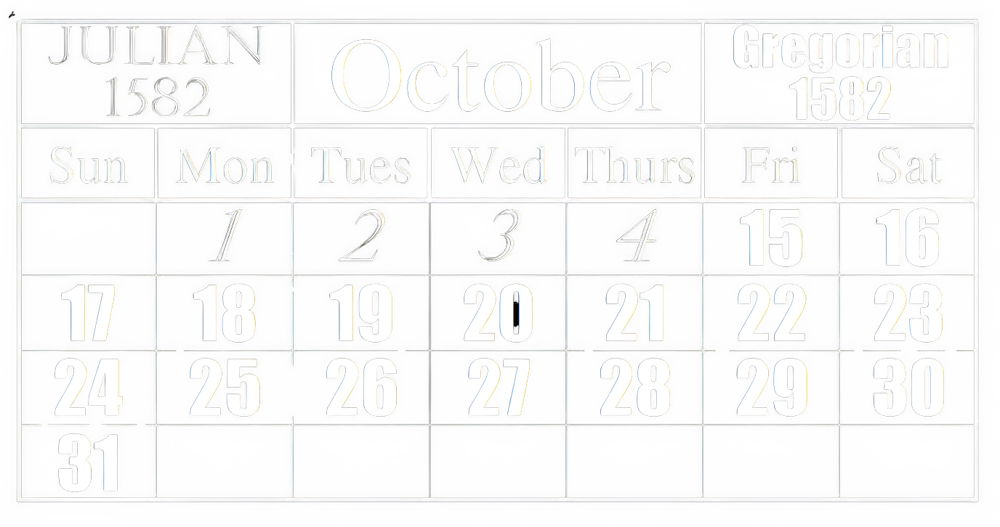

## Calendar

 
"What's the date today?" is one of the most common questions you can ask (might be to see how many [days](./day.html) you have before an assignment deadline, exams or someone's GPL). Since time immemorial, people have used [calendars](#calendar) to help measure the passage of time and answer questions such as these.

Any calendar has two traditional roles:

1. It must keep track of time across lengthy periods of time, allowing people to anticipate the seasonal cycle and commemorate specific religious or personal events.
2. It muse use natural time intervals on which everyone can agree - those established by the motions of the Earth, Moon, and, in some cases, planets.

Our calendar's natural units are the [day](./day.html), the month, which is based on the cycle of the Moon's phases about Earth; and the year, which is based on the period of revolution of Earth about the Sun. These three periods are not commensurable, which is another way of stating that one does not split equally into any of the others, and this has led to difficulties.

### Julian Calendar

Proposed in 46 BC, the [Julian calendar](#julian-calendar) (named after Julius Caesar, who reigned durind that period) is a solar calendar, following the [solar day](./day.html#solar-day) consisting of 365 [days](./day) every year with an additional leap day every fourth year (without exception).

There are two different kinds of years in the [Julian calendar](#julian-calendar): a regular year with 365 days and a leap year with 366 days. Their pereodic cycle consists of three regular years and one extra year, resulting in an average of 365.25 days. That is more than the actual solar year value, which is currently estimated to be around 365.2422 days. As a result, the [Julian calendar](#julian-calendar) advances by one day every 129 years. Put otherwise, every 400 years, the [Julian calendar](#julian-calendar) acquires 3.1 days.

### Gregorian Calendar

Used in most parts of the world, the [Gregorian calendar](#gregorian-calendar) (named after the then Pope, Pope Gregory XIII) came into effect in October 1582, as a modification of, and replacement for the [Julian calendar](#julian-calendar). The major change was the definition of leap years. The rule now became:

{: .quote }

> "Every year that is exactly divisible by four is a leap year, except for years that are exactly divisible by 100, but these centurial years are leap years if they are exactly divisible by 400. For example, the years 1700, 1800, and 1900 are not leap years, but the year 2000 is."

Since the [Julian Calendar](#julian-calendar) incorrectly assumed that the average solar year is 365.25 days long, an overestimate of little under one day per century, and thus has a leap year every 4 years without exception. The Gregorian reform shortened the average (calendar) year by 0.0075 days to stop the drift of the calendar with respect to the [equinoxes](../celestial%20sphere/equatorial.html#equinoxes).

As a result of moving away from the [Julian calendar](#julian-calendar) to the [Gregorian calendar](#gregorian-calendar), ten days were omitted from the [Julian calendar](#julian-calendar) and the day following October 4$$^{th}$$, the day on which the [Gregorian calendar](#gregorian-calendar) was adopted, was October 15 in 1582.

